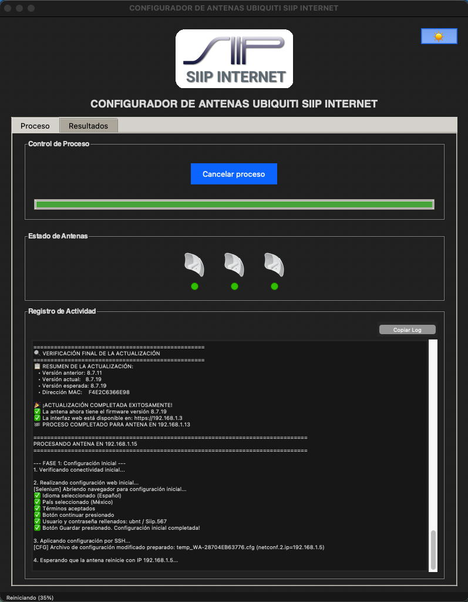
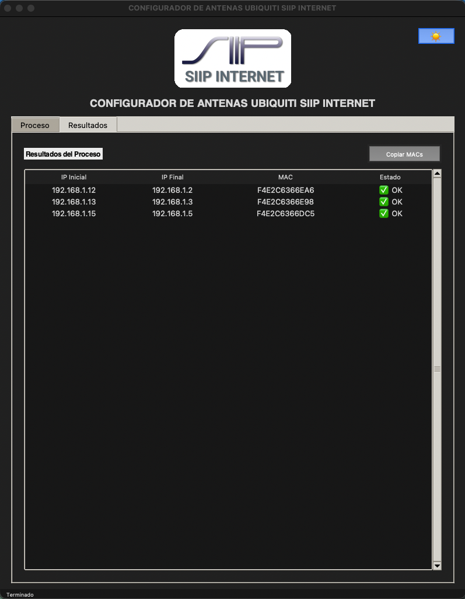

# Configurador de Antenas SIIP INTERNET


Herramienta de automatización avanzada con interfaz gráfica para la configuración masiva y actualización de firmware de antenas Ubiquiti (serie WA/XC). Diseñada para optimizar el flujo de trabajo de técnicos e instaladores de SIIP INTERNET.

## 📸 Capturas de Pantalla

### Vista General
La interfaz principal permite definir el rango de IPs, cargar archivos de configuración/firmware y visualizar el progreso en tiempo real de cada antena individualmente.



### Resultados y Logs
Pestaña dedicada para visualizar el estado final de cada operación, con tabla de resultados exportables y opciones de depuración.



## ✨ Características Principales

- **Automatización Completa**: Configuración y actualización de firmware sin intervención manual constante.
- **Interfaz Gráfica Moderna**: GUI construida con `tkinter` y `ttk`, con soporte para temas y diseño responsivo.
- **Multi-Hilo**: Procesamiento paralelo de la interfaz y las tareas de fondo para evitar congelamientos.
- **Feedback Visual en Tiempo Real**: 
  - Barra de progreso granular por fases (Detección, Config Web, SSH, Reinicio, Actualización).
  - Iconos de estado dinámicos que se ajustan automáticamente a la cantidad de antenas detectadas.
- **Robustez**:
  - Manejo inteligente de errores y reintentos.
  - Verificación automática de versiones de firmware y conectividad.
  - Logs detallados con opción de filtrado para el usuario final.
- **Modos de Operación**:
  - **Full**: Configuración completa + Actualización de Firmware.
  - **Config**: Solo aplicación de configuración base.
  - **Update Only**: Solo actualización de firmware (ideal para antenas ya configuradas).
- **Flexibilidad**:
  - Configuración de rangos de IP independientes para cada tipo de tarea.

## 🛠️ Herramientas de Diagnóstico

La aplicación incluye herramientas integradas para facilitar el trabajo de campo:
- **Test de Conexión (Ping Scan)**: Botón dedicado para realizar comprobaciones rápidas de visibilidad de antenas en la red sin ejecutar scripts pesados.
- **Validación de MACs**: Copiado inteligente de direcciones MAC al portapapeles, filtrando errores y texto basura.

## 🚀 Instalación y Requisitos

### Requisitos del Sistema
- **Sistema Operativo**: macOS (Probado y optimizado), Linux o Windows.
- **Python**: 3.8 o superior.
- **Navegador**: Google Chrome (para la automatización con Selenium).

### Dependencias Python
El proyecto incluye un verificador de dependencias automático, pero puedes instalarlas manualmente:

El programa instala durante el arranque las dependencias Python que puede gestionar automáticamente. Las principales librerías son `Pillow`, `paramiko`, `selenium` y `webdriver-manager`; `tkinter` debe estar disponible en la instalación de Python.

## 🛠️ Uso

1. **Preparación**:
   - Conecta las antenas a la red local.
    - Asegúrate de tener un archivo de configuración (`.cfg`) y el firmware (`.bin`) seleccionados en la GUI. Consulta [la plantilla de ejemplo](examples/WA-example.cfg), pero adáptala a tu red antes de usarla.

2. **Ejecución**:
   ```bash
   python3 gui_configurador.py
   ```

3. **Operación**:
   - Ingresa el rango de IPs de las antenas (ej. 11 a 15).
   - Verifica las rutas de los archivos en "Archivo" > "Ajustes".
   - Presiona **"Iniciar proceso"**.

## 📂 Estructura del Proyecto

```
.
├── gui_configurador.py          # Script principal de la Interfaz Gráfica
├── configuracion_completa_antenas2.py  # Backend lógico de automatización
├── gui_settings.json            # Archivo de persistencia de configuraciones
├── app_manifest.json             # Nombre y versión de la aplicación
├── examples/WA-example.cfg      # Plantilla sanitizada de configuración
├── img/                         # Capturas de pantalla para documentación
└── ...
```

## 📝 Control de Cambios

Para ver el historial de versiones y cambios detallados, consulta el archivo [CHANGELOG.md](CHANGELOG.md).

Los backups `.cfg`, firmwares `.bin`, resultados y configuraciones operativas son archivos locales y están excluidos por `.gitignore`.

## 👤 Autor

Desarrollado para el equipo técnico de SIIP INTERNET.
